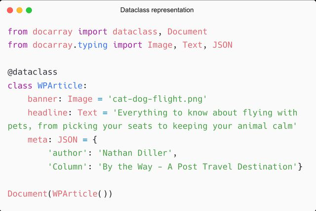

```
https://blog.csdn.net/u011459717/article/details/127877087
```
```
Document是DocArray中的基础对象，所有模态的数据类型，无论是文本、图像、视频、音频、3D网格还是这些模态的组合，都可以表示为一个Document。

Document对象有一系列属性，根据其内容，可以分为以下几类：

与内容相关：uri, text, tensor, blob；
与内部结构相关：chunks, matches, granularity, adjacency, parent_id；
通用信息：id, modality, mime_type, offset, location, weight，tags；
计算相关：scores, evaluations, embedding。
```


#### Document


```python

d = Document(uri='apple.png')
# 然后我们可以用d.load_uri_to_image_tensor()将图片加载成为张量矩阵
d.load_uri_to_image_tensor()


doc1 = Document(uri=img_path).load_uri_to_image_tensor().set_image_tensor_normalization().set_image_tensor_shape(
        (300, 300)).set_image_tensor_channel_axis(-1, 0)

# docs = DocumentArray([doc1,...])

import torchvision

model = torchvision.models.resnet50(pretrained=True)
#相似度比较可视化
docs.embed(model).embeddings
docs.plot_embeddings()


#
doc.embed(model)
doc.match(docs)
query_result = [(m.scores['cosine'].value, m.uri) for m in doc.matches]


#plot example
query_result.sort()# 距离从小到大排序
plt.subplot(3, 3, 1)
plt.xticks([])
plt.yticks([])
plt.grid(False)
plt.xlabel(f'query image')
plt.imshow(plt.imread(img_path_list[0]))
for idx, (dis,img_path) in enumerate(query_result):
    # f = urllib.request.urlopen(img_uri)
    plt.subplot(3, 3, idx + 4)
    plt.xticks([])
    plt.yticks([])
    plt.grid(False)
    plt.xlabel(f'emb distance {dis:.2f}')
    img = plt.imread(img_path)
    plt.imshow(img)
plt.tight_layout()
plt.show()


```


#### 