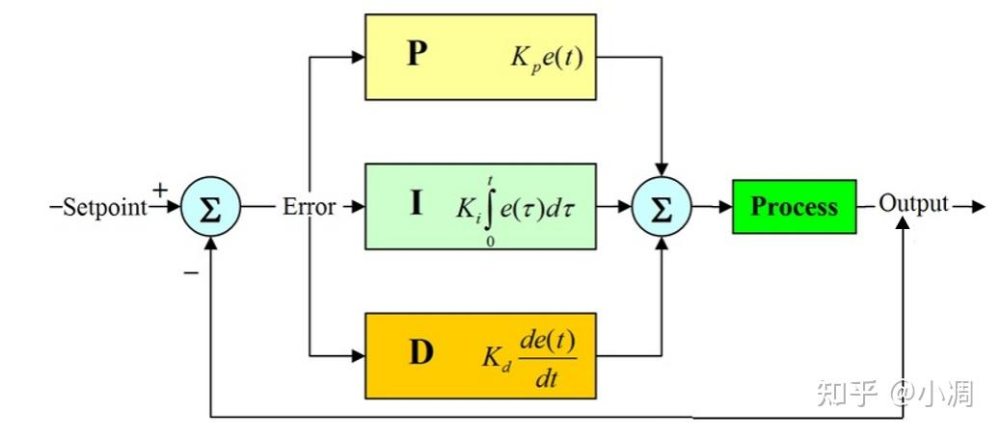

```python
import time

class PID:
    def __init__(self, kp, ki, kd):
        self.kp = kp
        self.ki = ki
        self.kd = kd
        self.previous_error = 0
        self.integral = 0
        self.last_time = time.time()

    def control(self, error):
        current_time = time.time()
        delta_time = current_time - self.last_time
        derivative = (error - self.previous_error) / delta_time
        self.integral += error * delta_time
        output = self.kp * error + self.ki * self.integral + self.kd * derivative
        self.previous_error = error
        self.last_time = current_time
        return output

def read_distance_sensor():
    # 在这里实现你的距离传感器代码，返回距离误差值
    x = input()
    return float(x)

def move_arm(distance):
    # 在这里实现你的机械臂移动代码，接受一个距离参数
    print(distance)

pid_controller = PID(kp=1, ki=0.1, kd=0.01)

while True:
    error = read_distance_sensor()  # 获取距离传感器返回的误差值
    print(error)
    arm_adjustment = pid_controller.control(error)  # 通过PID控制器计算机械臂的调整量
    move_arm(arm_adjustment)  # 控制机械臂移动
    time.sleep(0.01)  

```



### P = kp * error
>$k_{p}e(t) $
```python
#e(t)表示t时刻的误差
#运动体运动之后的误差直接赋值给error
```


### D = kd * derivative
<!-- >$k_{d} \cdot\ \frac{d_{e}(t)}{dt}$  -->

>$k_{d}  \frac{d_{e}(t)}{dt}$

```python
derivative = kd * (error - self.previous_error) / delta_time
#表示t时刻误差微分
#
```

### I = ki * integral 

>$k_{i} \int_1^0 e(x) \, dt$
```python
self.integral += error * delta_time
```


### 4.output
>$output=P*I*D $